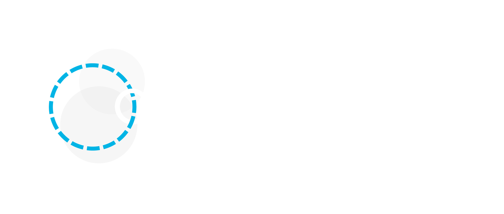

# OppyDev

OppyDev is a new agent based AI assisted coding tool focused on AI and human collaboration. It’s been built to streamline the back and forth process between the developer and AI, allowing you to code faster without losing sight of how things work. This repository hosts open source plugins and documentation for OppyDev. 

